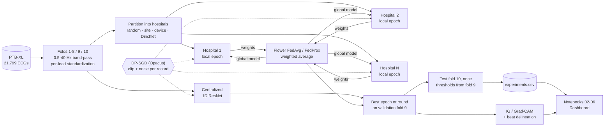

# fedecg-lab

[](https://github.com/martinoa2000/fedecg-lab/actions/workflows/ci.yml)
[](https://www.python.org/downloads/)
[](LICENSE)

Multi-label classification of 12-lead ECGs, used as a testbed for the question
that decides whether a clinical ML model can actually be built: **what does it
cost to train on data that never leaves the hospital?**

The experiments compare a centralized baseline against federated training
across simulated hospitals, then add realistic non-IID data, differential
privacy, and saliency-based explanations — measuring the accuracy given up at
each step.

> **Not a medical device.** Research and educational code only. See
> [Limitations](#limitations).

## Findings

Test macro AUROC on PTB-XL's official test fold. The centralized baseline, a
1D ResNet tuned on the validation fold, scores **0.917**; averaging three
seeds of it reaches **0.922** (published `resnet1d_wang`: 0.930).

1. **Decentralization costs 0.007 to 0.026 AUROC**, growing with the number of
   hospitals (5, 10, 20), at equal compute. Most of it is slower progress per
   pass over the data, not a lower ceiling.
2. **Realistic heterogeneity adds almost nothing.** Hospitals built from real
   recording sites and ECG devices, with very different label mixes, score as
   well as the same number of random hospitals or better. Only extreme
   synthetic label skew costs a further ~0.017, and FedProx recovers none of it.
3. **Privacy is the expensive step.** DP-SGD at ε = 8 / 3 / 1 costs 0.024 /
   0.035 / 0.066 against the same recipe without privacy, and more when each of
   five hospitals applies it to its own, smaller dataset: 0.027 / 0.046 / 0.112.
4. **The model recognizes infarction from the QRS complex, not the ST
   segment**, consistent with PTB-XL's mostly old infarcts and their Q waves,
   and the finding held after the network was retrained wider. On the way
   there: zero-baseline Integrated Gradients is invalid for this
   (scale-invariant) network, and even corrected IG maps mostly show the
   input's shape; Grad-CAM largely passes the model-randomization test.

All findings were measured twice, before and after the baseline was tuned,
and each held; the numbers here are from the tuned baseline.

## The question

A hospital cannot usually ship patient ECGs to a central server. Federated
learning promises a way around that: train locally, share only model updates.
But that promise comes with costs that are rarely quantified side by side:

1. **Decentralization cost.** How much AUROC is lost by replacing one training
   set with N hospitals running FedAvg?
2. **Heterogeneity cost.** Real hospitals do not hold random samples. They have
   different recording devices and different patient mixes. How far does that
   push performance down, and does FedProx recover any of it?
3. **Privacy cost.** Model updates still leak. Adding DP-SGD buys a formal
   guarantee — at what epsilon does the model stop being useful?
4. **Trust.** When the model does fire on a myocardial infarction, is it looking
   at the ST segment, or at noise?

## Dataset

[PTB-XL](https://physionet.org/content/ptb-xl/1.0.3/) (PhysioNet): 21,799
clinical 12-lead ECGs from 18,869 patients, 10 seconds each. This project uses
the 100 Hz version so everything runs on a laptop.

- **Task:** multi-label classification over the 5 diagnostic superclasses —
  `NORM`, `MI`, `STTC`, `CD`, `HYP`. Records can carry several at once.
- **Split:** the authors' recommended `strat_fold` split — folds 1–8 train,
  fold 9 validation, fold 10 test. Folds 9 and 10 were human-validated. Using
  this split is what makes the numbers here comparable to published baselines.
- **Primary metric:** macro AUROC, with per-class F1 reported alongside.

The data is **never committed**. `scripts/download_data.py` fetches it from
PhysioNet and verifies every file against the official `SHA256SUMS.txt`.

## How it works



Every experiment is one YAML file in `configs/`. Configs inherit through
`extends`, so the diff between two files is exactly what that experiment
changes: the federated configs extend the centralized one, the private ones
extend both. Every model is selected on the same validation fold and scored
once on the same test fold, and every run appends one row to
`results/tables/experiments.csv`.

## Quickstart

Requires [uv](https://docs.astral.sh/uv/) and Python 3.11+.

```bash
git clone https://github.com/martinoa2000/fedecg-lab.git
cd fedecg-lab
uv sync
```

Download PTB-XL (~1.8 GB download, ~1 GB on disk after extraction):

```bash
uv run python scripts/download_data.py
```

Produce the exploration tables and figures (label balance, co-occurrence,
per-site/device breakdown, example signals) into `results/`:

```bash
uv run python scripts/explore_data.py
```

Train the centralized baseline. Check the pipeline first with a two-minute
smoke run (1,000 training records, 2 epochs), then run the real thing:

```bash
uv run python scripts/train_centralized.py --config smoke.yaml
uv run python scripts/train_centralized.py
```

The first training run caches all waveforms in `data/cache/` as a single
`.npz`, so later runs skip WFDB parsing. Test metrics and the per-epoch history
land in `results/tables/`, weights in `checkpoints/`, and every run is logged
to MLflow (`uv run mlflow ui --backend-store-uri sqlite:///mlruns/mlflow.db`).
Every run also writes one summary row to `results/tables/experiments.csv`,
which the notebooks and the dashboard read.

Train across simulated hospitals. Each config in `configs/` is one experiment;
the smoke config checks the pipeline in under a minute:

```bash
uv run python scripts/train_federated.py --config smoke_federated.yaml

# Phase 4: FedAvg on random (IID) splits
for n in 5 10 20; do
  uv run python scripts/train_federated.py --config fedavg_iid_$n.yaml
done

# Phase 5: hospitals by recording site, by device, and by Dirichlet label skew
for p in site device dirichlet; do
  for s in fedavg fedprox; do
    uv run python scripts/train_federated.py --config ${s}_$p.yaml
  done
done
```

On an Apple M-series laptop each run takes 2 to 4 minutes.

Differential privacy (phase 6) and explanations (phase 7):

```bash
for c in dp_none dp_eps8 dp_eps3 dp_eps1; do
  uv run python scripts/train_centralized.py --config $c.yaml
done
for c in fed_dp_none fed_dp_eps8 fed_dp_eps3 fed_dp_eps1; do
  uv run python scripts/train_federated.py --config $c.yaml
done
uv run python scripts/explain_model.py   # explains checkpoints/centralized.pt
```

Or reproduce every number in this README in one go (about three and a half
hours, mostly DP-SGD and the tuning study); pass phase numbers to run only
some of them:

```bash
scripts/reproduce.sh          # phases 2-7 and the tuning study, then the export
scripts/reproduce.sh 6 7      # only privacy and explanations
```

Try to raise the baseline without touching the test fold. `scripts/tune.py`
trains exactly like the baseline but scores only the validation fold, and
writes one row per setting to `results/tables/tuning.csv`. The options are
config keys: `model.base_channels`, `training.augment` (gain, noise, baseline
wander, lead dropout), `training.loss` (`bce`, `weighted_bce`, `focal`) and
`training.ensemble_seeds`:

```bash
uv run python scripts/tune.py --config tune_wide_augment.yaml
```

Or do it from the dashboard. Start the local training server in one terminal
and the dashboard in another; the **Tuning and training** page then lets you
pick options, start a validation-only run, follow its curve live, stop it, or
rerun any experiment config for real:

```bash
uv run python scripts/serve.py      # training server on 127.0.0.1:8765
npm --prefix app run dev            # dashboard; its /api proxy reaches the server
```

The server binds to 127.0.0.1 only, rejects requests from other origins, runs
one job at a time, and re-exports the dashboard data after each finished run.

Run the test suite:

```bash
uv run pytest
```

Explore the data in the dashboard (needs [Node.js](https://nodejs.org/) 22+):

```bash
uv run python scripts/export_dashboard.py
npm --prefix app install
npm --prefix app run dev
```

Then open http://localhost:5173. The export writes to `app/public/data/`, which is
git-ignored because it contains PTB-XL waveforms.

Enable the git hooks (lint, formatting, notebook output stripping):

```bash
uv run pre-commit install
```

## Roadmap

- [x] **1. Setup** — project structure, pinned dependencies, pre-commit, CI, reproducible data download.
- [x] **2. Exploration and preprocessing** — label distribution, per-class ECG visualization, filtering and normalization.
- [x] **3. Centralized baseline** — 1D ResNet, random-crop training, cosine schedule, early stopping, MLflow tracking, comparison against published PTB-XL results ([notebook 02](notebooks/02_centralized_baseline.ipynb)).
- [x] **4. Federated (IID)** — Flower FedAvg across 5, 10 and 20 simulated hospitals with random splits ([notebook 03](notebooks/03_federated_iid.ipynb)).
- [x] **5. Federated (non-IID)** — hospitals by recording site, by device and by Dirichlet label skew; FedAvg vs. FedProx ([notebook 04](notebooks/04_federated_non_iid.ipynb)).
- [x] **6. Differential privacy** — DP-SGD with Opacus, centralized and inside each federated hospital, at ε = 1, 3, 8 against no-privacy controls ([notebook 05](notebooks/05_differential_privacy.ipynb)).
- [x] **7. Explainability** — Integrated Gradients and Grad-CAM, beat-segment enrichment and the model-randomization check ([notebook 06](notebooks/06_explainability.ipynb)).
- [x] **8. Write-up** — findings, architecture diagram, comparative results table, one-command reproduction (`scripts/reproduce.sh`).

## Results

Test macro AUROC on the official test fold (fold 10), one run per setting with
seed 42. Retraining the baseline with three seeds gives 0.917, 0.919 and 0.918,
so gaps smaller than about 0.003 are noise. Full table:
`results/tables/experiments.csv`.

| Phase | Setting | Hospitals | Macro AUROC | vs. centralized |
|---|---|---:|---:|---:|
| | Published `resnet1d_wang` (Strodthoff et al., 2021) | 1 | 0.930 | |
| 3 | **Centralized** (64 channels, crops, augmentation, cosine LR) | 1 | **0.917** | |
| 3 | Centralized, ensemble of 3 seeds | 1 | 0.922 | +0.005 |
| 3 | Centralized, before tuning (32 channels, crops only) | 1 | 0.916 | −0.001 |
| 3 | Centralized, first recipe (full-length records, constant LR) | 1 | 0.909 | −0.008 |
| 4 | FedAvg, IID | 5 | 0.910 | −0.007 |
| 4 | FedAvg, IID | 10 | 0.901 | −0.016 |
| 4 | FedAvg, IID | 20 | 0.891 | −0.026 |
| 5 | FedAvg, by recording site | 4 | 0.913 | −0.004 |
| 5 | FedAvg, by device | 8 | 0.911 | −0.006 |
| 5 | FedAvg, Dirichlet label skew (alpha 0.3) | 10 | 0.884 | −0.032 |
| 5 | FedProx (mu 0.01), by site / device / label skew | 4 / 8 / 10 | 0.909 / 0.908 / 0.881 | −0.007 / −0.009 / −0.036 |
| 6 | Centralized, DP recipe without privacy | 1 | 0.898 | −0.019 |
| 6 | Centralized, DP-SGD, ε = 8 / 3 / 1 | 1 | 0.874 / 0.863 / 0.832 | −0.043 / −0.054 / −0.085 |
| 6 | FedAvg IID, DP recipe without privacy | 5 | 0.867 | −0.050 |
| 6 | FedAvg IID, DP-SGD per hospital, ε = 8 / 3 / 1 | 5 | 0.840 / 0.821 / 0.755 | −0.077 / −0.096 / −0.161 |

The DP rows keep the 32-channel network and their own recipe (batches of
1,024 centrally, 30 epochs or rounds), which costs AUROC even without noise;
the privacy cost proper is each row's gap to its no-privacy control. δ = 10⁻⁵
throughout.

**How the baseline was tuned.** A validation-only study of training options
(`scripts/tune.py`, `results/tables/tuning.csv`), each against the recipe
before tuning:

| Setting (validation fold only) | Val macro AUROC | vs. before tuning |
|---|---:|---:|
| Before tuning (32 channels, crops only) | 0.920 | |
| Focal loss | 0.920 | ±0.000 |
| Class-weighted loss | 0.922 | +0.001 |
| More augmentation (gain, noise, wander, lead dropout) | 0.922 | +0.002 |
| Wider network (64 base channels, 1.6M parameters) | 0.922 | +0.002 |
| Wider network + augmentation | 0.925 | +0.004 |
| Ensemble of 3 seeds | 0.925 | +0.005 |
| **Wider + augmentation, ensemble of 3** | **0.928** | **+0.007** |

Wider + augmentation became the baseline; the ensemble is reported
separately because it applies to any setting at three times the cost, and the
phases compare single models. On test the single-model gain shrank to +0.002
on average over three seeds (0.918 against 0.916): picking the best of eight
settings on one fold flatters the winner. Averaging seeds held up (+0.005).

Where the baseline looks (Grad-CAM enrichment: share of attention in a beat
segment divided by the share of time it covers; 1 is chance), over 100
correctly detected test ECGs per class, with the same network at random
weights for comparison:

| Class | QRS complex | ST segment | T wave | Reading |
|---|---:|---:|---:|---|
| MI | **2.66** | 0.71 | 0.59 | Q waves of old infarcts, not ST elevation (random-weight maps are empty) |
| HYP | **1.70** (random 0.37) | 1.31 (random 0.70) | 0.97 | learned attention to QRS voltage, some to the ST segment |
| CD | **2.24** (random 0.49) | **2.80** (random 0.07) | 0.53 | learned; part of the "ST" may be the widened QRS tail |
| STTC | 0.94 | 1.62 (random 1.85) | **1.63** (random 1.35) | T-wave attention above the random network's |

What the numbers say, phase by phase, is in the notebooks: the baseline
([02](notebooks/02_centralized_baseline.ipynb)), decentralization
([03](notebooks/03_federated_iid.ipynb)), heterogeneity
([04](notebooks/04_federated_non_iid.ipynb)), privacy
([05](notebooks/05_differential_privacy.ipynb)) and trust
([06](notebooks/06_explainability.ipynb)).

## Repository layout

```
fedecg-lab/
├── app/              # Dashboard (Vite + React): data, results, training page
├── configs/          # Experiment configs (YAML, with `extends` inheritance)
├── notebooks/        # 01..06, numbered; concepts explained before code
├── scripts/          # Data download, experiments, tune.py, serve.py, reproduce.sh
├── src/fedecg/       # The reusable package
│   ├── data/         # PTB-XL loading, labels, preprocessing, partitioning
│   ├── models/       # 1D ResNet
│   ├── training/     # Training loop, metrics, results table, MLflow
│   ├── federated/    # Flower client, strategies, in-process simulation
│   ├── privacy/      # DP-SGD with Opacus, calibrated to a target epsilon
│   └── explain/      # Saliency, beat delineation, randomization check
├── tests/            # Fast unit tests (no dataset, no training)
└── results/          # Committed tables and figures
```

Notebooks are for learning and exploration; once a piece of code works it moves
into `src/fedecg/`, gets a test, and is imported back into the notebook.

## Design notes

**GroupNorm, not BatchNorm.** Opacus cannot privatize BatchNorm, because its
batch statistics mix information across samples and break the per-sample
gradient accounting DP-SGD relies on. Rather than train one architecture for
the baseline and a different one under DP, the model uses GroupNorm everywhere
so all phases stay directly comparable.

**Reproducibility.** Fixed seeds, versioned configs, and an exact `uv.lock`.
Data partitioning uses explicitly-passed NumPy generators rather than global
random state, since the split across hospitals *is* the experiment.

**Zero-phase filtering, train-only statistics.** The 0.5–40 Hz band-pass runs
forwards and backwards so ST segments do not shift relative to the QRS, and the
per-lead standardizer is fitted on the training split only. It is serializable,
so the federated phases can compare global against per-hospital statistics.

**One budget, one selection rule.** Every federated config extends the
centralized one, so model, data split, preprocessing and training recipe are
identical. With every hospital training one local epoch per round, a round
costs one pass over the training set, the same as a centralized epoch; both
get at most 50. All models are selected at the epoch or round with the best
validation AUROC, and validation and test stay on the server, unsplit.

**Standardization under federation.** Per-lead mean and standard deviation can
be computed exactly from each hospital's sums, sums of squares and counts, so
the federated runs use the same pooled statistics as the baseline without any
record leaving a hospital.

**The baseline is tuned, the DP network is not.** The phase 3 recipe carries
the winner of a validation-only tuning study (64 channels, extra augmentation),
and phases 4, 5 and 7 inherit it. Phase 6 keeps the 32-channel network its
DP recipe was tuned for: per-record gradients of the wider model at batch
1,024 do not fit a laptop's memory, and DP noise, added in every parameter's
direction, tends to hurt wider networks more.

**Privacy is measured against a matched control.** DP-SGD needs its own
recipe (large batches, a higher learning rate, 30 epochs), which also changes
the non-private model. Each DP setting therefore has a twin config with privacy
switched off, and the cost of privacy is the gap to that twin. The noise is
calibrated before training so the whole planned run spends exactly the target
ε; picking the best epoch on the validation fold is post-processing and costs
no privacy.

**Saliency is checked against a random network.** Integrated Gradients starts
from a blurred copy of each record, not zeros: the ResNet's bias-free first
convolution followed by GroupNorm makes it scale-invariant, so the usual
zero baseline carries no information. Every map is also computed for the same
architecture with random weights (Adebayo et al., 2018), and only differences
from that are read as the model's reasoning.

**Tests without the dataset.** `tests/conftest.py` writes a miniature PTB-XL
tree (same CSV columns, same WFDB record format) so the loading, labeling and
splitting code is exercised in CI without the 1.8 GB download.

**Laptop-sized.** No GPU required. Every config exposes a `subsample` option for
fast smoke runs, and CI never trains anything.

## Limitations

- **Simulated federation.** Clients are Flower `NumPyClient`s and aggregation is
  Flower's own FedAvg / FedProx, but the clients run one after another in a
  single process instead of in Ray workers (see `fedecg.federated.simulation`).
  This reproduces the *statistical* consequences of decentralization, not real
  network conditions, stragglers, or systems failures.
- **Single-country data.** PTB-XL was collected in Germany between 1989 and
  1996 by a single provider. Partitioning it into synthetic "hospitals" cannot
  reproduce genuine cross-institution distribution shift.
- **Record-level, not hospital-level privacy.** DP-SGD inside each client
  protects individual records within that client. It does not hide a hospital's
  participation, which needs noise at aggregation time instead.
- **One seed per setting.** Three seeds of the baseline span 0.002 AUROC;
  differences smaller than about 0.003 between single runs are not meaningful.
- **DP hyperparameters were tuned without privacy accounting.** The DP recipe
  was chosen on the validation fold, as is common in DP papers; a deployment
  would tune on public data or pay for the search in ε.
- **Saliency is correlational.** Enrichment shows where attribution falls, not
  that the model uses that segment causally, and the delineator's segment
  boundaries (from lead II only) are themselves imperfect, especially for wide
  QRS complexes.
- **Not clinically validated.** Superclass labels are a coarse simplification of
  the full diagnostic hierarchy. Nothing here is fit for clinical use.

## References

- Wagner et al. (2020). *PTB-XL, a large publicly available electrocardiography dataset.* Scientific Data 7, 154.
- Strodthoff et al. (2021). *Deep Learning for ECG Analysis: Benchmarks and Insights from PTB-XL.* IEEE JBHI 25(5).
- McMahan et al. (2017). *Communication-Efficient Learning of Deep Networks from Decentralized Data.* AISTATS.
- Li et al. (2020). *Federated Optimization in Heterogeneous Networks (FedProx).* MLSys.
- Abadi et al. (2016). *Deep Learning with Differential Privacy.* CCS.
- Hsu et al. (2019). *Measuring the Effects of Non-Identical Data Distribution for Federated Visual Classification.* arXiv:1909.06335.
- Sundararajan et al. (2017). *Axiomatic Attribution for Deep Networks.* ICML.
- Selvaraju et al. (2017). *Grad-CAM: Visual Explanations from Deep Networks via Gradient-based Localization.* ICCV.
- Adebayo et al. (2018). *Sanity Checks for Saliency Maps.* NeurIPS.
- Sturmfels et al. (2020). *Visualizing the Impact of Feature Attribution Baselines.* Distill.

## License

MIT for the code in this repository. PTB-XL is distributed by PhysioNet under
its own license and is not redistributed here.
